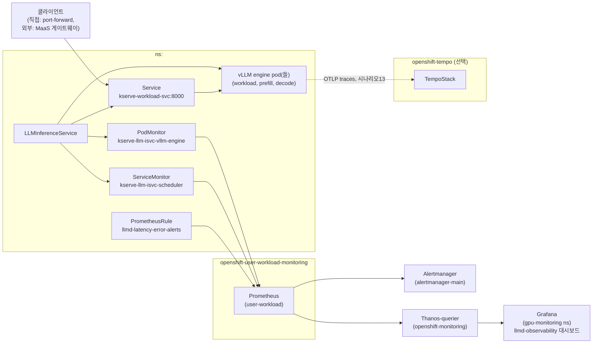

# monitoring-llmd-rhoai

OpenShift AI(RHOAI) + llm-d를 **관측하고, 분산 환경에서 실제로 어떻게 동작·장애·복구하는지 검증**하기 위한
QA 테스트케이스/시나리오 모음. 클러스터 구축과 재현 가능한 실행은
[openshift-aws-harness](https://github.com/jangminjun/openshift-aws-harness)의 `harness.sh` 서브커맨드로
하네스화되어 있고, 이 저장소는 그 위에서 도는 **테스트 설계·절차·실측 결과** 쪽을 담당한다.

## 목적

1. **관측성**: llm-d(RHOAI `LLMInferenceService`)의 메트릭이 실제로 어떤 이름으로, 어떻게 수집·시각화·
   알림되는지 문서와 실측으로 검증한다 (TC-01~05).
2. **분산 환경 활용**: 알림이 오는 수준을 넘어서, llm-d를 **분산 환경에서 실제로 어떻게 쓰고 운영하는지**
   시나리오로 검증한다 — 병렬화 전략, 장애/복구, 요청 추적, 지연 진단 (시나리오 11~14+).

## 아키텍처 (실측)

RHOAI 3.4.4 기준으로, llm-d는 **별도의 Helm/Operator 설치가 필요 없다**. RHOAI가 KServe의
`LLMInferenceService` CRD를 통해 llm-d를 네이티브로 제공한다:

- `LLMInferenceService` CR 하나로 vLLM 엔진(+ 필요 시 prefill/decode 분리 워커, 라우터/스케줄러(EPP))이 구성됨.
- 컨트롤러가 **ServiceMonitor/PodMonitor를 자동 생성**함
  (`kserve-llm-isvc-scheduler(-default)`, `kserve-llm-isvc-vllm-engine(-default)`). 수동 스크랩 설정 불필요.
- 메트릭은 relabeling으로 `kserve_vllm:...` 접두사가 붙음 (원본 vLLM 메트릭 `vllm:...`가 아님).
- 별도 실패 카운터가 없음. `kserve_vllm:request_success_total{finished_reason="error"}`는 요청이 vLLM
  엔진에 들어간 뒤 생성 중 실패한 경우만 잡고, 컨텍스트 초과·잘못된 파라미터 같은 요청 검증 단계 거부
  (HTTP 4xx)는 잡지 못함 (실측 확인, [test-results-2026-09-07.md](docs/test-results-2026-09-07.md)). 그래서
  에러율은 **`kserve_http_requests_total`의 `status` 라벨**(`4xx`/`5xx`) 기준으로 계산한다.
- MaaS(Models-as-a-Service)를 쓰려면 RHCL(Kuadrant: Authorino+Limitador)이 별도로 필요하고, DSC의
  `spec.components.kserve.modelsAsService.managementState: Managed`로 활성화한다 — RHOAI **3.3+**부터만
  지원 (2.x 계열에는 이 필드 자체가 없음, `openshift-aws-harness`의 `stable` OLM 채널이 2.x를 가리킬 수
  있으니 `stable-3.4` 등으로 명시 필요 — 실제로 이 문제에 걸렸던 기록은 harness 쪽
  `lessonlearn.md`/커밋 참고).



## 시나리오

| # | 이름 | 무엇을 검증하나 | 상태 | 하네스 명령 |
|---|---|---|---|---|
| TC-01~05 | [관측성 활성화→알림](docs/test-cases.md) | 스택 활성화 → 메트릭 수집 → 대시보드 → 실시간 모니터링 → 임계값 알림 | 실측 완료 | `llmd-monitoring` |
| 11 | [데이터 병렬화(DP)](docs/scenarios/11-data-parallelism.md) | replica 1개 vs N개일 때 처리량이 실제로 스케일되는지 | **실측 완료** — 고정 부하로는 +10%뿐(부하도 같이 늘려야 함, 중요 발견) | `scenario11-llmd-dp-*` |
| 12 | [장애 및 복구](docs/scenarios/12-failure-recovery.md) | 워크로드 pod가 죽었을 때 요청 실패율(blast radius)과 복구 시간 | **실측 완료** — 복구 384초, 실패는 서버 메트릭에 안 잡힘(중요 발견) | `scenario12-llmd-failure-*` |
| 13 | [요청 추적(Tracing)](docs/scenarios/13-request-tracing.md) | 요청 하나가 Gateway→EPP→vLLM 어디서 시간을 썼는지 trace로 확인 | **부분 실측** — 파이프라인 검증됨(startup span 확인), 요청단위 trace는 추가 설정 필요 | `scenario13-llmd-tracing-*` |
| 14 | [지연(delay) 진단](docs/scenarios/14-latency-diagnosis.md) | queue/prefill/decode 중 어디가 병목인지 메트릭으로 구분 | **실측 완료** — decode 9.6s로 단독 병목 확인 | `scenario14-llmd-latency-*` |
| 15 | [텐서 병렬화(TP)](docs/scenarios/15-tensor-parallelism.md) | 멀티GPU 텐서 분할 서빙 | **계획만** (멀티GPU 노드 필요) | 미구현 |
| 16 | [Expert 병렬화(EP, MoE)](docs/scenarios/16-expert-parallelism.md) | MoE 모델의 expert 분산 | **계획만** (MoE 모델+멀티GPU 필요) | 미구현 |

각 시나리오 문서는 목적/사전조건/절차(하네스 명령어)/예상 결과/실측 결과(실행 후 채움) 구조로 통일되어
있어, 다른 사람이 문서만 보고 그대로 재현할 수 있다. "실행 대기"인 시나리오는 스크립트·문서가 모두
준비되었고 클러스터에서 실제로 돌려 결과를 채우는 것만 남은 상태 — 실행되는 대로 표와 각 문서를 갱신한다.

## 사전 조건

- OCP 4.19.9+, RHOAI 3.3+ (`LLMInferenceService`/`modelsAsService` 지원, 3.4.4로 검증됨)
- 기본 클러스터(bastion→cluster→GPU→RHOAI→모니터링→로깅)는
  [openshift-aws-harness](https://github.com/jangminjun/openshift-aws-harness)로 구축 (`./harness.sh all`)
  — 이 리포는 그 위에 llm-d/MaaS 관련 설정만 추가한다.
- MaaS/llm-d 모델 배포/시나리오는 **이 리포의 `harness/`**를 사용 (`cd harness && ./harness.sh maas` 등)
- 시나리오 13(추적)은 추가로 `./harness.sh tracing` 필요
- 시나리오 11(DP)은 GPU 노드가 replica 수만큼 필요 (`GPU_INSTANCE_TYPE`/`gpu-machineset`은
  openshift-aws-harness 쪽에서 조정)

## 재현 방법 (에이전트/사람 공용 실행 절차)

클러스터 접속 정보는 이 리포의 `AGENT.md` 참고 (`oc login ...`). 클러스터 자체를 처음부터 만들어야 한다면
[openshift-aws-harness](https://github.com/jangminjun/openshift-aws-harness)의 `harness/README.md`를
따라간다. 아래 명령은 전부 **이 리포의 `harness/` 디렉터리**에서 실행한다 (`cd harness`).

1. **관측성 스택 확인** — 이미 Managed 상태여야 함:
   ```sh
   oc get dsci default-dsci -o yaml | grep -A3 monitoring:
   ```
2. **MaaS/RHCL 활성화** (한 번만, idempotent):
   ```sh
   ./harness.sh maas
   ```
3. **대상 LLMInferenceService 확인 + 자동 모니터 wiring 확인**:
   ```sh
   oc get llminferenceservice -n <namespace>
   oc get servicemonitor,podmonitor -n <namespace>
   ```
4. **모니터링 + 알림 적용** (harness 명령, TC-01~05 자동화):
   ```sh
   LLMD_NAMESPACE=<namespace> ./harness.sh llmd-monitoring
   ```
5. **모델 엔드포인트에 직접 접근** (MaaS 외부 게이트웨이는 별도 API 키 체계라 `oc` 토큰으로는 401 남 —
   워크로드 Service로 포트포워딩):
   ```sh
   oc port-forward -n <namespace> svc/<llmd-name>-kserve-workload-svc 18000:8000 &
   curl -sk -X POST https://localhost:18000/v1/chat/completions \
     -H "Content-Type: application/json" \
     -d '{"model":"<model-name>","messages":[{"role":"user","content":"hi"}],"max_tokens":16}'
   ```
6. **분산 환경 시나리오 실행** — 위 시나리오 표의 하네스 명령을 순서대로 (예: DP):
   ```sh
   LLMD_NAMESPACE=llmd-scenario11 ./harness.sh scenario11-llmd-dp-start
   ./harness.sh scenario11-llmd-dp-load
   LLMD_NAMESPACE=llmd-scenario11 LLMD_REPLICAS=2 ./harness.sh scenario11-llmd-dp-scale
   ./harness.sh scenario11-llmd-dp-load
   ./harness.sh scenario11-llmd-dp-stop
   ```

실제 실행 결과와 겪었던 이슈는 [docs/test-results-2026-09-07.md](docs/test-results-2026-09-07.md),
[lessonlearn.md](lessonlearn.md) 참고.

## 디렉터리 구조

```
harness/
  harness.sh               llm-d/MaaS 하네스 진입점 (maas, llmd-*, tracing, scenario11-14)
  config.env                bastion 접속 정보 (BASTION_IP, SSH_KEY_PATH)
  lib.sh                     ssh_bastion/scp_to_bastion 헬퍼
  remote/*.sh                 실제 원격 실행 스크립트 (SSH로 bastion에 파이프됨)
  remote/dashboards/           llmd-observability.json (Grafana 대시보드)
docs/
  test-cases.md                    QA 테스트케이스 (TC-01 ~ TC-05, 절차/기대결과)
  test-results-2026-09-07.md       실클러스터 실행 결과 (실측치)
  scenarios/                       분산 환경 활용 시나리오 (11~16, 목적/절차/예상·실측 결과)
manifests/
  dsci-observability-patch.yaml   관측성 스택 활성화 확인/패치용 DSCI CR 예시
  servicemonitor-llmd.yaml        (참고용) 컨트롤러가 자동 생성하는 ServiceMonitor/PodMonitor 사본
  prometheusrule-llmd-alerts.yaml TTFT/에러율 임계값 알림 규칙 (kserve_vllm:, kserve_http_requests_total 기준)
grafana/
  llmd-dashboard.json     TTFT·처리량·에러율 대시보드
lessonlearn.md            프로젝트 수행 중 발견한 이슈/교훈
AGENT.md                  클러스터 접속 정보 + 실측 아키텍처 요약 (다음 세션 재개용)
```

`openshift-aws-harness`(별도 리포)는 기본 클러스터 설치만 담당한다 — bastion, OpenShift, GPU 노드,
RHOAI, 모니터링/로깅 스택. MaaS/RHCL, llm-d 모델 배포, 트레이싱, 분산 시나리오 데모는 전부 여기
`harness/`가 담당한다 (2026-09-08 재구성 — 예전엔 openshift-aws-harness에 같이 있었음, `lessonlearn.md`
참고).

## 임계값 (가정치, SLO 확정 전)

| 지표 | 임계값 | 지속시간 |
|---|---|---|
| TTFT (p95) | > 2초 | 5분 |
| 에러율 | > 5% | 5분 |

> 실제 서비스 SLO가 확정되면 `manifests/prometheusrule-llmd-alerts.yaml`의 값을 갱신하세요.
