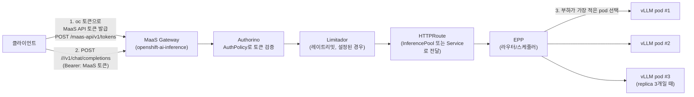

# 시나리오 11: 데이터 병렬화 (Data Parallelism)

**모듈:** 분산 환경 활용 > 병렬화 전략
**관련 컴포넌트:** `LLMInferenceService`(replicas), EPP(라우터), Thanos-querier

## 목적

llm-d(RHOAI `LLMInferenceService`)에서 모델을 여러 replica로 복제했을 때, EPP가 실제로 요청을
분산시키고 **처리량(throughput)이 replica 수에 비례해 늘어나는지**를 실측으로 확인한다. DP는 우리
클러스터(GPU 노드 여러 개, 각 1장)에서 추가 리소스 없이 바로 검증 가능한 병렬화 전략이다.

## 요청 흐름 (MaaS 경유)



**이 시나리오에서 실제로 검증하는 지점: 3번 — EPP가 replica 1개일 때와 N개일 때 요청을 실제로
분산시키는지, 그래서 aggregate 처리량이 늘어나는지.** 1~2번(MaaS 토큰 발급, Authorino/Limitador)은
실제 운영 환경의 진입 경로이지만, `scenario11-llmd-dp-load.sh`는 자동화 단순화를 위해 클러스터 내부에서
워크로드 Service로 직접 요청을 보낸다(MaaS 게이트웨이를 거치지 않음) — 즉 위 그림의 EPP 이후 구간만
실측한다. MaaS 토큰 발급부터 전체를 거치게 하려면 절차의 `curl` 대상을
`https://maas.<domain>/<ns>/<name>/v1/chat/completions` + `Authorization: Bearer <MaaS 토큰>`으로 바꾸면 된다.

## 사전 조건

- GPU 노드가 목표 replica 수만큼 Ready 상태 (`oc get nodes -l nvidia.com/gpu.present=true`)
- RHOAI 3.4+, MaaS 불필요 (직접 Service 접근으로 테스트)
- `monitoring-llmd-rhoai` 체크아웃, `oc login` 완료

## 절차

```sh
cd monitoring-llmd-rhoai/harness  # 리포 루트 기준

# 1) 1 replica로 배포 (baseline)
LLMD_NAMESPACE=llmd-scenario11 LLMD_NAME=llmd-dp-demo ./harness.sh scenario11-llmd-dp-start

# 2) baseline 처리량 측정 (concurrency=8, 90초 부하)
LLMD_NAMESPACE=llmd-scenario11 LLMD_NAME=llmd-dp-demo ./harness.sh scenario11-llmd-dp-load

# 3) N replica로 스케일 (N = GPU 노드 수, 이 클러스터는 g5.2xlarge가 2개라 N=2로 실측함)
LLMD_NAMESPACE=llmd-scenario11 LLMD_NAME=llmd-dp-demo LLMD_REPLICAS=2 ./harness.sh scenario11-llmd-dp-scale

# 4) 스케일 후 처리량 재측정 (같은 부하로)
LLMD_NAMESPACE=llmd-scenario11 LLMD_NAME=llmd-dp-demo ./harness.sh scenario11-llmd-dp-load

# 5) 정리
LLMD_NAMESPACE=llmd-scenario11 LLMD_NAME=llmd-dp-demo ./harness.sh scenario11-llmd-dp-stop
```

부하 강도는 `CONCURRENCY`(기본 8), `DURATION`(기본 90초)로 조절 가능.

## 예상 결과

- 1 replica: 처리량이 해당 GPU 1장의 최대 처리 능력에서 포화(saturate)됨 — `kserve_vllm:num_requests_waiting`가
  0보다 커지기 시작.
- N replica: EPP가 요청을 여러 workload pod로 분산시켜 **aggregate 처리량이 대략 N배 가까이 증가**해야
  함 (완벽한 선형 스케일링은 아닐 수 있음 — 라우팅 오버헤드, 캐시 지역성 손실 등으로 다소 낮을 수 있음).
- 각 pod의 `kserve_http_requests_total` 증가량이 고르게 분산되는지도 확인 가치 있음 (EPP가 특정 pod로
  쏠리지 않는지).

## 실측 결과 (2026-09-08, myocp/sandbox3790, Qwen2.5-7B-Instruct, concurrency=8, 90초)

**실행 자체는 성공(EPP가 정상적으로 2개 pod로 분산) — 그런데 처리량은 예상대로 배로 안 늘었다.**

| replica 수 | aggregate 처리량 |
|---|---|
| 1 | 3.99 req/s |
| 2 | 4.38 req/s (**+10%뿐**) |

**왜 2배가 아니었나:** `CONCURRENCY=8`을 고정한 채 replica만 1→2로 늘렸다. 즉 클라이언트가 동시에 보내는
요청 총량은 그대로 8개인데, 이게 이미 **replica 1개가 큐잉 없이 처리할 수 있는 수준**이었다면(=1개
GPU가 아직 포화 상태가 아니었다면), replica를 늘려도 각 pod가 요청을 좀 더 적게 나눠 받을 뿐 총
처리량은 크게 안 늘어난다 — "동시요청 8개를 pod 2개가 나눠 처리 = 절반씩" 정도의 효과만 남는다.
**교훈: DP 스케일링을 제대로 보려면 replica 수와 함께 부하(concurrency)도 비례해서 늘려야 한다** —
예를 들어 1 replica일 때 concurrency=8로 이미 포화시킨 뒤, 2 replica일 때는 concurrency=16으로 다시
포화시켜서 비교해야 진짜 스케일링 효과가 보인다. (다음 실행 후보로 남겨둠 — `CONCURRENCY` 환경변수로
바로 조절 가능.)

- EPP가 실제로 두 pod 모두에 트래픽을 분산시키는 것 자체는 확인됨(2번째 replica가 스케줄된 뒤 aggregate
  처리량이 실제로 변화함 — 라우팅이 죽은 pod에만 몰리지 않았다는 방증).

## 겪은 이슈

- GPU가 노드당 1장뿐이라, 다른 시나리오(12)가 같은 `g5.2xlarge` GPU를 이미 점유하고 있으면 2번째
  replica가 스케줄이 안 된다 (`Insufficient nvidia.com/gpu`) — 다른 시나리오의 모델을 먼저 정리
  (`scenario12-llmd-failure-stop`)해야 했다. 여러 시나리오를 동시에 돌릴 계획이면 시나리오 수만큼
  GPU 노드를 미리 확보해둘 것.
- 부하 스크립트의 `"model":"placeholder"` 하드코딩 버그(다른 시나리오와 동일) — 실제 모델명을
  `LLMInferenceService`에서 조회하도록 수정.

## 현재 상태 (2026-09-08)

측정 완료 후 GPU를 다른 시나리오(14)에 돌려주기 위해 **1 replica로 다시 축소**해둠
(`LLMD_REPLICAS=1 ./harness.sh scenario11-llmd-dp-scale`). `llmd-scenario11/llmd-dp-demo`는 계속 떠
있어서 Grafana `llm-d Observability` 대시보드에서 `llmd-scenario11`을 선택하면 바로 확인 가능
(`LLMD_NAMESPACE=llmd-scenario11 ./harness.sh llmd-monitoring` 적용됨). 정리하려면
`./harness.sh scenario11-llmd-dp-stop`.
