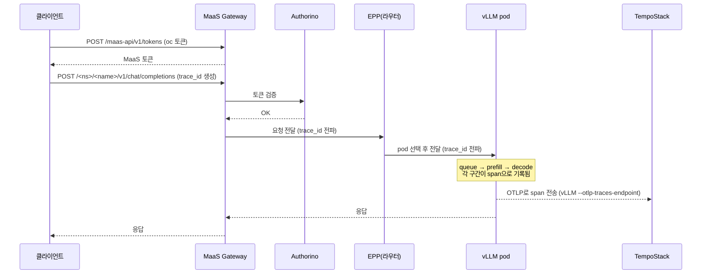

# 시나리오 13: 요청 추적 (Request Tracing)

**모듈:** 분산 환경 활용 > 요청 추적
**관련 컴포넌트:** vLLM(OTLP), TempoStack, Jaeger UI

## 목적

집계 메트릭(TTFT 평균/p95 등)만으로는 "왜 이 특정 요청이 느렸는지"를 알 수 없다. llm-d는 하나의
`trace_id`를 Gateway → EPP → (KV-cache indexer) → vLLM까지 전파해서, 요청 하나 단위로 "어느 pod로
라우팅됐는지, prefill에 얼마나 걸렸는지, 디코드 큐에서 얼마나 대기했는지"를 분산 트레이스로 볼 수 있게
한다. 이 시나리오는 그 파이프라인을 우리 클러스터에 실제로 붙여서 확인한다.

## 요청 흐름 (MaaS 경유) — trace_id가 어디를 따라가나



**이 시나리오가 검증하는 지점: vLLM이 OTLP span을 실제로 내보내는지, 그리고 그 span이 하나의 trace로
Tempo에서 조회 가능한지.** `scenario13-llmd-tracing-demo.sh`는 워크로드 Service에 직접 요청을 보내
(MaaS 게이트웨이 생략) vLLM 자체의 트레이싱만 확인한다 — Gateway/EPP 구간까지 trace_id가 이어지는지
(위 그림의 앞부분)까지 검증하려면 MaaS 게이트웨이가 자체적으로 OTLP를 내보내는지 별도 확인이 필요하다
(RHCL/Envoy Gateway 쪽 트레이싱 설정 — 이 저장소에서는 아직 확인 못함, 실측 결과에 기록 예정).

## 사전 조건

- `./harness.sh tracing` 실행 완료 (COO + RHBO(OpenTelemetry) + Tempo Operator + TempoStack, MinIO 기반)
- `monitoring-llmd-rhoai` 체크아웃, `oc login` 완료

## 절차

```sh
cd monitoring-llmd-rhoai/harness  # 리포 루트 기준

# 0) 트레이싱 스택 설치 (한 번만)
./harness.sh tracing

# 1) OTLP 추적이 켜진 모델 배포 + 샘플 요청 5건 전송
LLMD_NAMESPACE=llmd-scenario13 LLMD_NAME=llmd-tracing-demo ./harness.sh scenario13-llmd-tracing-demo

# 2) Jaeger UI로 확인 — `tracing`이 Route를 자동으로 만들어줌, 포트포워딩 불필요
oc get route llmd-tracing-jaeger-ui -n openshift-tempo -o jsonpath='{.spec.host}'
# 브라우저에서 https://<위 host>/ → 상단 Service 드롭다운에서 검색 (지금은 unknown_service로 나옴, 아래 참고)

# 3) 정리
LLMD_NAMESPACE=llmd-scenario13 LLMD_NAME=llmd-tracing-demo ./harness.sh scenario13-llmd-tracing-stop
```

## 예상 결과

- 각 요청마다 하나의 trace가 생성되고, 그 안에 prefill/decode/큐 대기 등 세부 구간(span)이 나뉘어 보여야
  함 (vLLM의 OTLP 익스포터가 이 정보를 span으로 만듦).
- 여러 요청의 trace를 비교해서, 유독 느린 요청이 있다면 그 trace를 열어 "무엇 때문에 느렸는지"(큐
  대기 vs prefill vs decode)를 바로 알 수 있어야 함 — 이게 시나리오 14(지연 진단)의 집계 지표와
  상호보완적으로 쓰이는 지점.

## 리스크 / 확인 필요

- vLLM `--otlp-traces-endpoint` 플래그의 정확한 스킴(grpc:// 접두사 필요 여부)은 vLLM 버전에 따라 다를
  수 있음 — 이 저장소의 harness 스크립트(`llmd-deploy-model.sh` + `scenario13-llmd-tracing-demo.sh`)는
  `grpc://tempo-llmd-tracing-distributor.<ns>.svc:4317`로 시도하며, 실제 실행 시 트레이스가 안 보이면
  vLLM 컨테이너 로그에서 OTLP 익스포터 관련 에러를 먼저 확인할 것.

## 실측 결과 (2026-09-08, myocp/sandbox3790, Qwen2.5-7B-Instruct)

**부분 성공 — 파이프라인 자체(vLLM → OTLP → TempoStack)는 검증됨, 요청 단위 trace는 아직 못 봄.**

- vLLM이 실제로 OTLP span을 Tempo로 보내는 것 자체는 확인됨: Jaeger API(`/api/traces`)로 조회하니
  **모델 시작(startup) 과정의 span 12개**가 하나의 trace로 잡혔다 (`Worker init`, `Load model`,
  `Allocate KV cache`, `Warmup (GPU)` 등, `code.filepath`/`code.function`/`code.lineno`까지 포함된 진짜
  코드 레벨 span). 즉 vLLM ↔ Tempo 배선(gRPC, 인증, 버킷)은 전부 정상.
- 그런데 실제로 보낸 추론 요청 5건에 대한 trace(원래 목적이었던 queue/prefill/decode 구간)는 안 보임.
  vLLM 시작 로그의 `observability_config`에 `collect_detailed_traces=None`이라는 별도 필드가 있는 걸
  확인함 — **요청 단위 상세 트레이싱은 `--otlp-traces-endpoint`만으로는 안 켜지고 별도 플래그가 더
  필요할 가능성이 높다.** 정확한 플래그명/값은 아직 확인 못함 (다음 실행 후보).
- 서비스 이름이 `unknown_service`로 나옴 — `OTEL_SERVICE_NAME` 환경변수를 안 넣어서 OpenTelemetry SDK
  기본값이 사용된 것. 여러 모델을 동시에 트레이싱할 계획이면 이것도 설정해야 Jaeger에서 구분 가능.

## 후속 작업 (하네스 개선 후보)

- vLLM의 요청 단위 상세 트레이싱을 켜는 정확한 플래그 확인 (vLLM 소스/문서에서 `collect_detailed_traces`
  검색) 후 `llmd-deploy-model.sh`의 `LLMD_EXTRA_VLLM_ARGS`에 반영
- `OTEL_SERVICE_NAME` 환경변수를 `llmd-deploy-model.sh`에 추가해 서비스명이 실제 모델/인스턴스명으로
  나오게 하기
- MaaS 게이트웨이(Envoy/RHCL) 자체도 OTLP를 내보내는지 확인 — 지금은 vLLM 이후 구간만 확인됨

## 겪은 이슈 (하네스 버그, 이미 수정됨)

- `LLMD_EXTRA_VLLM_ARGS`를 `cmd_scenario13_llmd_tracing_demo`에서 설정했는데, 이 값을 실제로 bastion에
  SSH로 넘기는 `cmd_llmd_deploy_model`의 env var 목록에서 빠져 있어서 **트레이싱 플래그 자체가 한 번도
  전달된 적이 없었다** (1차 실행에서 trace가 0건이었던 진짜 원인). `harness.sh`를 고쳐 전달 목록에 추가.
- 이 클러스터는 GPU가 노드당 1장이라, spec 변경(트레이싱 플래그 추가)으로 새 ReplicaSet이 생겨도 **예전
  ReplicaSet이 GPU를 계속 붙잡고 있어서 새 pod가 못 뜨는** 문제를 겪음 (`scenario8-kserve-vllm-start.sh`
  주석에 이미 기록돼 있던 것과 동일한 패턴, `LLMInferenceService`에서도 똑같이 재현됨). 예전 pod만
  지우면 ReplicaSet이 다시 만들어버리므로, **예전 ReplicaSet 자체를 `--replicas=0`으로 스케일**해야
  진짜로 해결됨.
- 위 GPU 경합 때문에 cluster-autoscaler가 불필요한 GPU 노드를 하나 더 만들었다가(진짜 원인은 "자리
  없음"이 아니라 "예전 pod가 붙잡고 있음"이었음), 원인 해결 후 다시 줄여야 했다.
- **Jaeger UI Route가 503만 뱉던 문제(2026-09-08 (4)):** `oc expose --port=`에 서비스에 없는 임의 포트
  이름(`16686-tcp`)을 써서 Route는 생겼지만 라우팅이 안 됐다 — 실제 포트 이름은 `jaeger-ui`. 백엔드
  자체는 `port-forward`로는 정상 응답해서(200) 원인 찾는 데 시간이 걸렸다. `tracing.sh`가 이제
  올바른 포트명으로 Route(+edge TLS)를 자동 생성한다 — 위 절차의 "포트포워딩 불필요"가 그 결과.

## 현재 상태 (2026-09-08)

`llmd-scenario13/llmd-tracing-demo`가 계속 떠 있음 — Jaeger UI에서 직접 열어볼 수 있음
(`oc get route llmd-tracing-jaeger-ui -n openshift-tempo`). 정리하려면
`./harness.sh scenario13-llmd-tracing-stop`.
