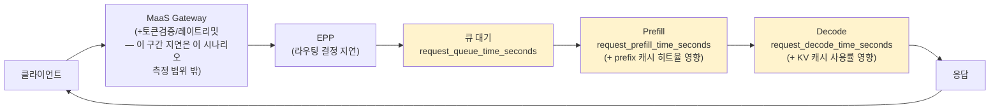

# 시나리오 14: 지연(delay) 진단

**모듈:** 분산 환경 활용 > 지연 진단
**관련 컴포넌트:** `kserve_vllm:request_queue_time_seconds`, `request_prefill_time_seconds`,
`request_decode_time_seconds`, `prefix_cache_hits/queries_total`, `kv_cache_usage_perc`

## 목적

"느리다"는 하나의 증상 뒤에 여러 원인이 있을 수 있다 — 스케줄러 큐 대기, prefill(프롬프트 처리) 지연,
decode(토큰 생성) 지연, 낮은 prefix 캐시 히트율. 이 시나리오는 부하를 발생시킨 뒤 이 네 가지를
**하나의 진단 리포트로 한 번에** 뽑아서, "다음에 뭘 고쳐야 하는지"를 바로 알 수 있게 한다.

## 요청 흐름 (MaaS 경유) — 지연이 어디서 쌓이나



**이 시나리오가 측정하는 구간은 노란색으로 표시된 세 곳(큐 대기/prefill/decode)** — vLLM 엔진 내부의
시간 분해다. MaaS Gateway/EPP 자체의 라우팅 결정 지연은 이번 진단 리포트에 포함되지 않는다(별도로
Gateway 쪽 메트릭/트레이스로 봐야 함 — 시나리오 13의 trace를 열어보면 Gateway→EPP→vLLM 각 구간의 실제
소요 시간을 개별 요청 단위로 확인할 수 있다. 이 시나리오는 그 대신 **다수 요청의 집계 분포**를 준다).

## 사전 조건

- 대상 `LLMInferenceService`가 Ready 상태
- Thanos-querier 접근 가능

## 절차

```sh
cd monitoring-llmd-rhoai/harness  # 리포 루트 기준

# 1) 모델 배포
LLMD_NAMESPACE=llmd-scenario14 LLMD_NAME=llmd-latency-demo ./harness.sh scenario14-llmd-latency-start

# 2) 부하 발생 + 진단 리포트 출력 (concurrency=6, 60초)
LLMD_NAMESPACE=llmd-scenario14 LLMD_NAME=llmd-latency-demo ./harness.sh scenario14-llmd-latency-diagnose

# 3) 정리
LLMD_NAMESPACE=llmd-scenario14 LLMD_NAME=llmd-latency-demo ./harness.sh scenario14-llmd-latency-stop
```

## 진단 리포트 읽는 법

스크립트가 출력하는 5개 지표를 이렇게 해석한다:

| 지표 | 높으면 의미하는 것 | 대응 |
|---|---|---|
| Queue time (p95) | 요청이 처리되기 전 스케줄러에서 대기 | replica 늘리기(시나리오 11) 또는 EPP 라우팅/InferencePool 포화 확인 |
| Prefill time (p95) | 프롬프트가 길거나 캐시를 못 씀 | prefix 캐시 히트율 같이 확인, 프롬프트 재사용 패턴 점검 |
| Decode time (p95) | 토큰 생성 자체가 느림 | KV 캐시 사용률/preemption 확인, 모델·GPU 스펙 재검토(TP 등) |
| Prefix cache hit rate (hits/queries) | 낮으면 매번 처음부터 재계산 | 시스템 프롬프트/컨텍스트 재사용 여부, 캐시 크기(GPU 메모리) 검토 |
| KV cache usage | preemption(선점) 위험 | replica 늘리거나 `--gpu-memory-utilization` 조정 |

## 예상 결과

- 정상 상태에서는 queue/prefill/decode 시간이 모두 낮고 캐시 히트율이 높아야 함.
- 부하가 커지면 먼저 queue time이 늘어나기 시작 (스케줄러 대기) → 그 다음 decode time (동시 실행
  시퀀스 증가로 인한 경합) 순으로 악화되는 게 일반적인 패턴.

## 실측 결과 (2026-09-08, myocp/sandbox3790, Qwen2.5-7B-Instruct, replica 1, concurrency=6, 60초)

**통과 — 병목이 명확하게 한 곳으로 짚였다.**

| 지표 | 실측치 (p95) |
|---|---|
| Queue time | 0.285 s |
| Prefill time | 0.289 s |
| **Decode time** | **9.633 s** |
| TTFT | 0.362 s |
| Prefix cache hit rate | hits≈2148.6 / queries≈2863.8 (≈75%) |
| KV cache usage | 0 (preemption 없음) |

**읽기:** queue/prefill/TTFT는 전부 1초 미만으로 정상인데 decode time만 9.6초로 압도적으로 크다 —
이 부하 조건(동시 6개, 응답 최대 150토큰)에서는 **토큰 생성(decode) 자체가 유일한 병목**이라는 뜻.
캐시 히트율(75%)도 준수해서 prefill 쪽 문제는 아님. 진단 리포트의 읽는 법 표가 실제로 맞아떨어진
사례 — decode가 병목이면 다음으로 볼 것: KV 캐시 사용률(0%라 preemption은 아님) → 남은 원인은 동시
요청 수 대비 GPU 연산 자체의 한계, 즉 replica 추가(시나리오 11) 또는 더 큰/빠른 GPU·텐서 병렬화(시나리오
15)가 다음 조치.

## 겪은 이슈 (하네스 버그, 이미 수정됨)

- scenario12와 동일한 두 버그(`"model":"placeholder"` 하드코딩, `oc whoami -t` 토큰 실패)에 걸렸다가
  수정 후 재실행 — 첫 실행은 모든 지표가 `NaN`/0으로 나와서 바로 이상 신호를 알아챌 수 있었음 (데이터가
  하나도 없으면 진단 리포트 자체가 무의미하다는 걸 스스로 드러내는 셈이라, 이런 실패 모드는 오히려
  발견하기 쉬웠다).
